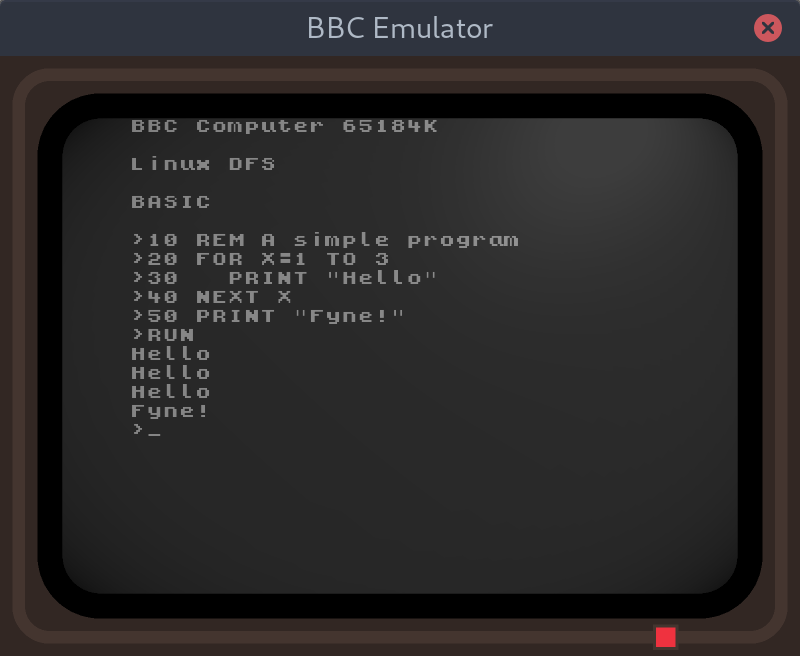

# beebUI
A BBC Micro Emulator based on Fyne and skx/gobasic

## TODO - almost everything

This is the beginning of a fun project, but only the rendering is ready for sharing"

## Features

It looks kind of nice:

## Acknowledgements

Thanks to [skx/gobasic](https://github.com/skx/gobasic) for the BASIC interpreter.

Font is KongText by [codeman38](https://www.1001fonts.com/users/codeman38/)